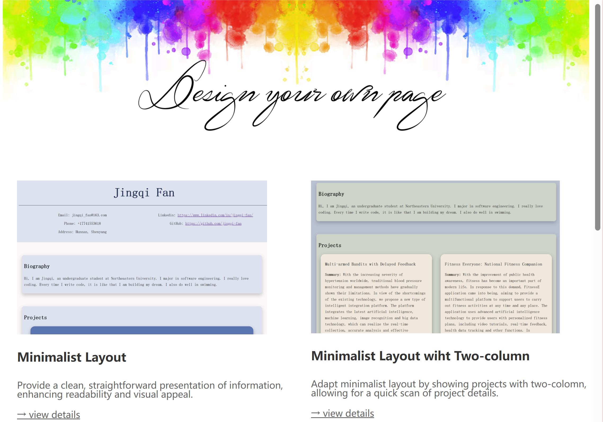
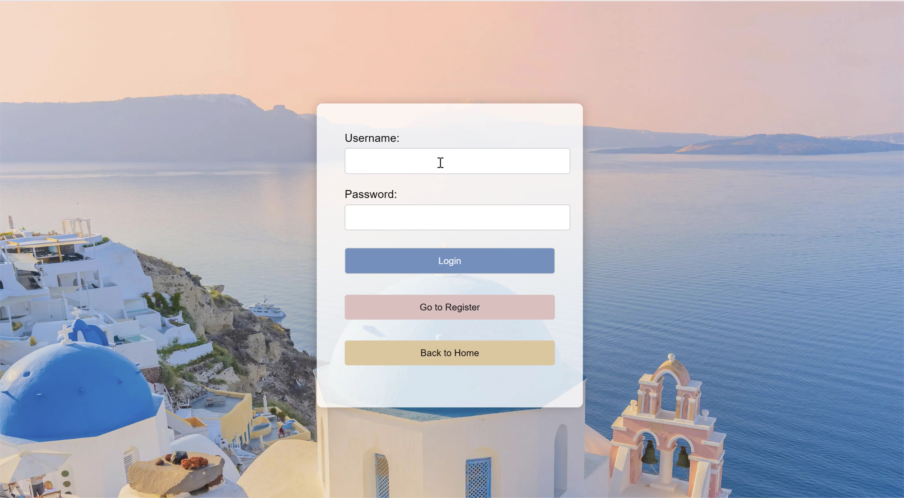
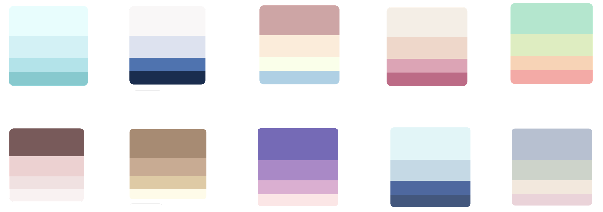

# Design-your-Own-Page
Final assignment in course Web Development Technologies

## function
### 1. View Sample Pages
- **Exploration**: Before signing in, users can explore various sample pages. These pages demonstrate the diverse designs and layouts available, providing a glimpse of what they can create.

### 2. Login and Register
- **Access Management**: Users need to register for an account to access personalized features. The registration process captures basic credentials like email and password. Once registered, users can log in to proceed with personalizing their site.

### 3. Input Personal Information
- **Personalization Input**: After logging in, users are prompted to input their personal information and project details. Users can also select their preferred color schemes and fonts. This step is crucial for tailoring the website to reflect their individual or professional identity.

### 4. Generate Personalized Page
- **Customization and Generation**:  Based on the choices and information provided, a personalized website is generated. This allows users to see their content integrated into the chosen template, ensuring the final product aligns with their aesthetic preferences and functional requirements.
- **Example:**

## Refenrence
- **background image**: https://www.weibo.com/p/1005051646592141/home?mod=TAB
